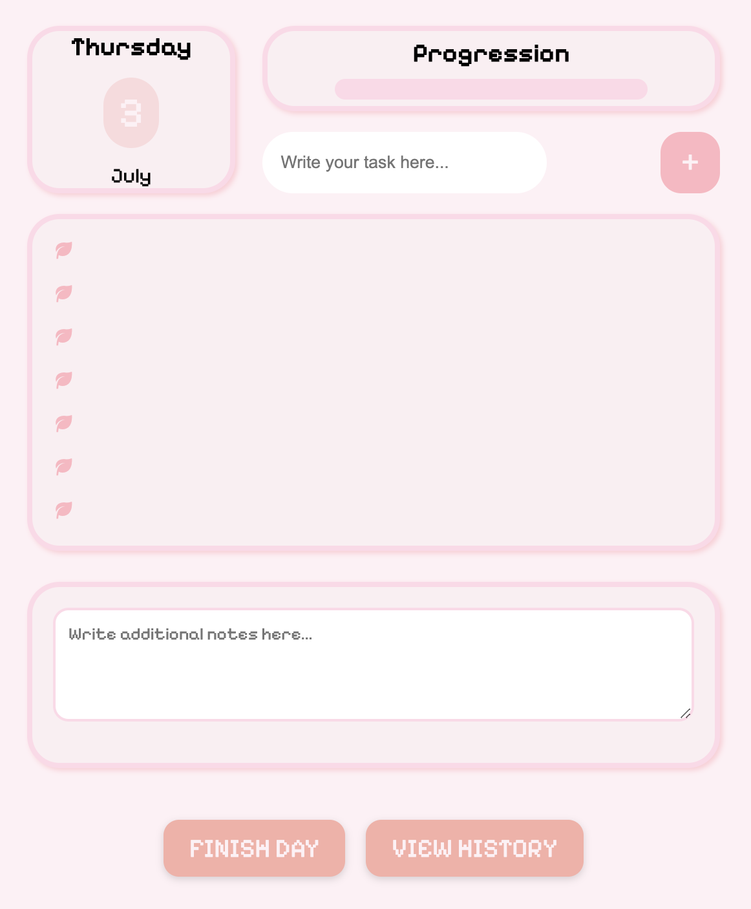

# 🌸 ProductiveJournal

> *A cozy, pixel-inspired digital journal to track your day, tasks, and reflections.*  

  

---

## ✨ Features

- 📅 **Daily Entries** — beautifully organize your notes and reflections
- ✅ **Task Checklist** — mark what you’ve accomplished and what’s left
- 📊 **History View** — look back on your journey and stay consistent
- 🖋 **Pixel-inspired UI** — a nostalgic, retro vibe that feels warm and personal
- 💾 **Local-first with SQLite** — all your data stays safe on your machine
- ⚡ **Smooth Electron-powered experience** — works completely offline
- 🎨 **Fully Customizable** — easily tweak colors, styling, and logic
- 🔒 **Zero Cloud** — total data privacy
- 🪄 **Fast & Lightweight** — minimal yet powerful
- 🧩 **Modular Codebase** — easy to extend and hack

---

## 🖼 App Interface

> *Here’s a peek into the cozy pixel-inspired UI:*  



---

## 🚀 Getting Started

1. **Clone this repository**

```bash
git clone https://github.com/yourusername/ProductiveJournal.git
cd ProductiveJournal
